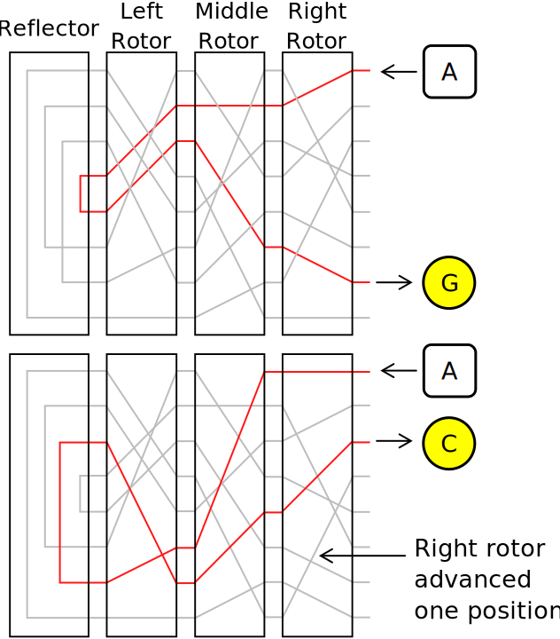

# How it works

## About the real enigma machine

The original enigma machine worked through an electrical pathway, defined by its components, which would scramble the signal for each letter.
When a letter was pressed, the signal would travel through the plugboard, then through three rotors and finally through the reflector. 
From the reflector, the signal would travel back through the rotors to the lamp, lighting up a letter.

After the letter was pressed, one or multiple rotors would step up, changing their position and the electrical pathway which connect all the letters.
This means that the same letter pressed twice consecutively would have two different outcomes.

More about the real enigma machine at its [Wikipedia page](https://en.wikipedia.org/wiki/Enigma_machine).

## Components

Here is explained the behavior of the different components that create an enigma machine.

### Plugboard

The **plugboard** (or _Steckerbett_ in German) allows wiring letters in pairs by a manual configuration from the operator.
In other words, the operator could choose two configurations for each letter:
- Not wired. In this case, if this letter was pressed (for example, the letter "A"), the signal sent to the next component would correspond still to the letter "A".
- Wired to another letter. For this, if "A" was wired to "T" means that if "A" is pressed, the signal "T" is given to the next component. Consequentially, when "T" was pressed, the signal "A" was communicated.

The plugboard allows creating a first layer of codification in which not all letters need to be connected.

### Rotors

**Rotors** connect two letters, which differs depending on the situation the rotor is in.
The position of each rotor shows the distance to connect the next letter.

These are some examples of the behavior:

| Rotor's position | Incoming signal | Outgoing signal |
|------------------|-----------------|-----------------|
| 0                | "A"             | "A"             |
| 1                | "A"             | "B"             |
| 5                | "A"             | "F"             |
| 14               | "S"             | "G"             |

Each time a letter is computed by the machine, the first rotor steps up.
When the rotor has done a full rotation, the next rotor steps up.
By so, the encoding of each letter changes every time one or more rotors step up.

While the original enigma machine was composed of three rotors, the `EnigmaMachine` package allows using as many or few rotors as desired.

### Reflector

The **reflector** is the component that allows an encoded message to be decoded by a machine with the same configuration.
This component has a static connection of letters by pairs, just like the plugboard, where all letters are connected.

The main differences of this component are:
- The connexions among the letters won't change through the ciphering of the text.
- The connexions cannot be changed manually.

By defining these static connexions, each configuration routes the same two keys at one state, allowing the decoding of messages. 
When a key is pressed, the signal travels from the plugboard through the rotors up to the reflector.
At this point, the signal travels back through the rotors (in inverse order) to the lamp, which is the same level as the plugboard.

Taking the picture at the top of the page, imagine the rotors will not ever move.
This means every time the letter "A" is pressed, the outcome is the letter "G".
In other words, "A" is directly connected to "G".
Therefore, when "G" is pressed, the letter "A" is to be the outcome.

This behavior is the one that the machine experiences to cipher a text, as the rotors will update their state when the finger is lifted from the key.
